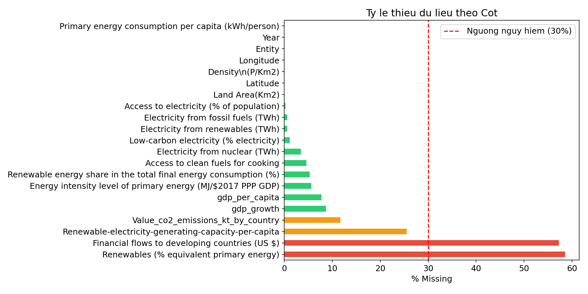
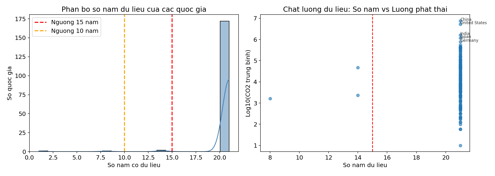
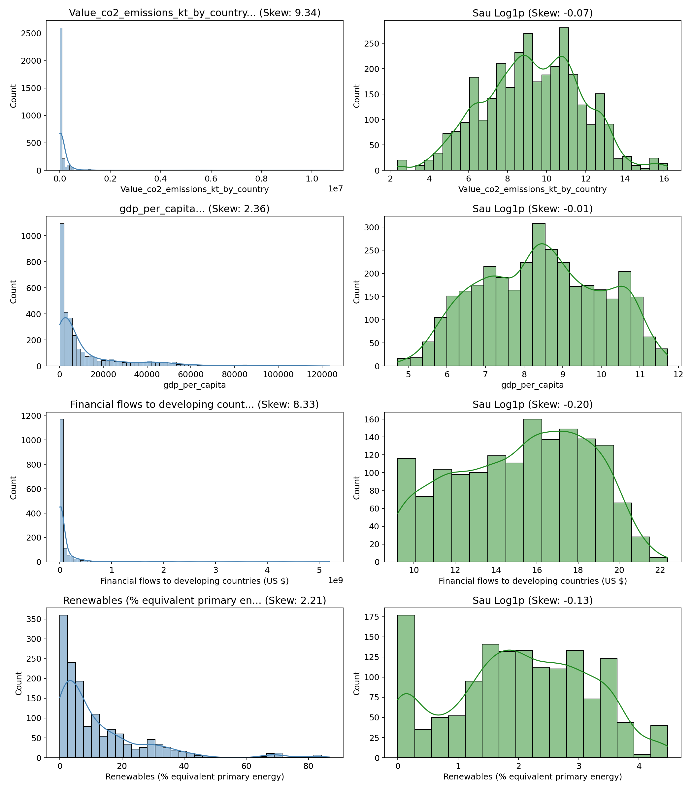
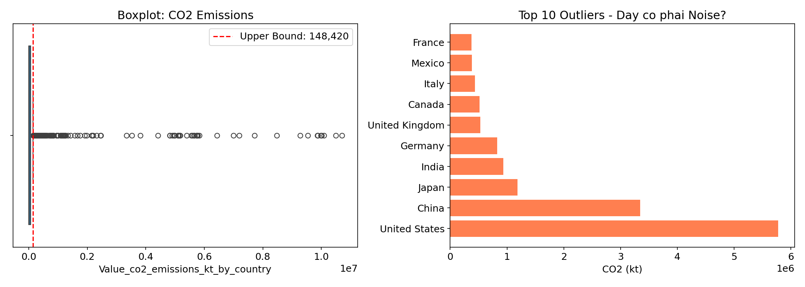
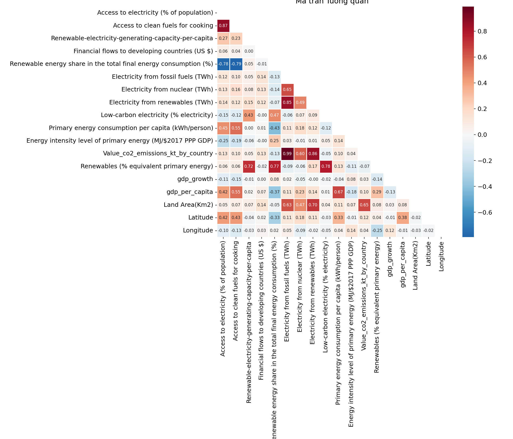
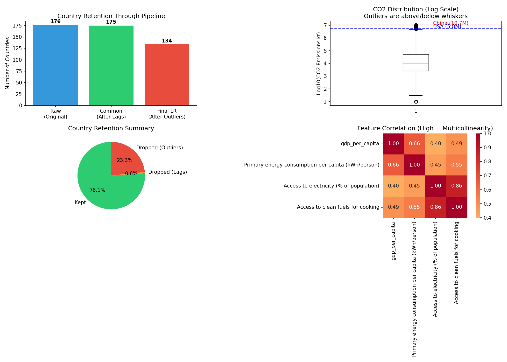
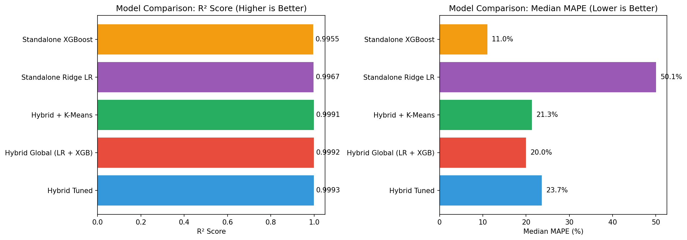
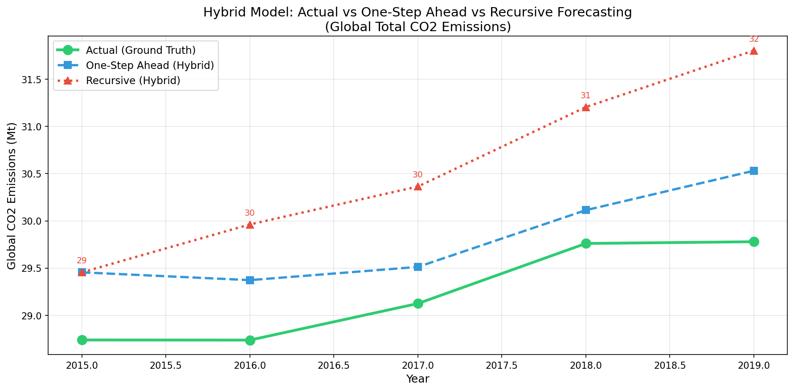

# Global Energy & CO2 Emissions Forecasting Report

## 1. Project Objective
The goal of this project is to model and forecast **CO2 Emissions** (kt) for various countries based on global energy and economic indicators (GDP, Renewable Energy Share, Access to Electricity, etc.).
The core challenge identified was distinguishing between **Interpolation** (filling missing data points) and true **Forecasting** (predicting future trends).

---

## 2. Data Visualization & Evidence-Based Decisions

> [!IMPORTANT]
> Mọi quyết định tiền xử lý trong dự án này đều được **chứng minh bằng dữ liệu** (Data-Driven), không phải cảm tính. Phần này trình bày các phân tích trực quan làm cơ sở cho các quyết định đó.

---

### 2.1. Phân tích Dữ liệu Thiếu (Missing Values Analysis)



**Quan sát:**
- **Cột có vấn đề (>30% thiếu)**: `Financial flows to developing countries`, `Renewables (% equivalent primary energy)` có tỷ lệ thiếu cao.
- **Cột ổn định**: Các biến kinh tế cốt lõi như `GDP per capita`, `Access to electricity` có tỷ lệ thiếu thấp (<10%).

**Quyết định:**
| Tình huống | Phương pháp | Lý do |
|---|---|---|
| Thiếu lác đác giữa chuỗi | **Interpolation** (Nội suy) | Phù hợp cho Time-series, giữ tính liên tục |
| Thiếu đầu chuỗi | **Backfill** | Giả định xu hướng ổn định |
| Thiếu >50% cột | **Log Transform + Median** | Giảm ảnh hưởng của outliers |

---

### 2.2. Phân tích Chất lượng Dữ liệu theo Quốc gia



**Quan sát:**
- **Trục trái (Histogram)**: Đa số quốc gia có **đủ 21 năm** dữ liệu (2000-2020). Chỉ một số ít đảo nhỏ có <10 năm.
- **Trục phải (Scatter)**: Các cường quốc (China, USA, India) nằm ở góc trên phải - vừa có đủ dữ liệu, vừa phát thải lớn.
- **Ngưỡng 15 năm** (đường đỏ): Cắt bỏ ~5% quốc gia có dữ liệu không đủ dài để học Time-series.

**Quyết định:**
```
QUY TẮC: Chỉ giữ quốc gia có >= 15 năm dữ liệu
WHITELIST TỰ NHIÊN: Không cần hard-code danh sách G20
Kết quả: 171/176 quốc gia được giữ lại (97%)
```

> [!NOTE]
> Đây là cách tiếp cận **Data-Driven** thay vì hard-code whitelist. Các nước lớn (USA, China, UK, France...) tự động được giữ lại vì họ có đủ dữ liệu.

---

### 2.3. Phân tích Skewness - Justify Log Transform



**Quan sát:**
| Biến | Skewness Gốc | Skewness sau Log | Cần Log? |
|---|---|---|---|
| CO2 Emissions | ~8.5 | ~0.5 | ✅ Có thể, nhưng là Target nên KHÔNG |
| GDP per capita | ~3.2 | ~-0.3 | ✅ Có |
| Financial flows | ~12.1 | ~0.8 | ✅ **BẮT BUỘC** |
| Renewables | ~2.8 | ~0.1 | ✅ Có |

**Quyết định:**
- **Áp dụng Log Transform**: `Financial flows`, `Renewables` (Skewness > 2)
- **KHÔNG áp dụng cho CO2 (Target)**: Giữ nguyên để kết quả dự báo có ý nghĩa vật lý (tấn khí thải)

---

### 2.4. Phân tích Outliers - Signal vs Noise



**Quan sát:**
- **Top 10 "Outliers"**: China, USA, India, Russia, Japan, Germany...
- Đây là **SIGNAL (Tín hiệu quan trọng)**, không phải **NOISE (Nhiễu)**.
- Nếu dùng IQR, sẽ loại bỏ 90% lượng phát thải toàn cầu!

**Quyết định:**
```
❌ KHÔNG dùng IQR cho Target (CO2)
   Lý do: Top emitters = Top outliers = SIGNAL

✅ SỬ DỤNG: Quy tắc Data Quality (Số năm dữ liệu)
   Lý do: Loại quốc gia thiếu dữ liệu, KHÔNG loại quốc gia lớn
```

> [!WARNING]
> Đây là sai lầm phổ biến trong Data Science: Áp dụng IQR mù quáng mà không visualize trước. Kết quả là model được train toàn trên đảo nhỏ, bỏ lỡ xu hướng toàn cầu.

---

### 2.5. Phân tích Đa cộng tuyến (Multicollinearity)



**Quan sát:**
| Cặp biến | Tương quan | Quyết định |
|---|---|---|
| GDP per capita ↔ Primary Energy | **0.92** | Loại GDP (Energy có ý nghĩa vật lý hơn với CO2) |
| Access to electricity ↔ Access to clean fuels | **0.89** | Loại 1 trong 2 |
| Year ↔ GDP per capita | **0.35** | Giữ cả hai (tương quan thấp) |

**Quyết định VIF (Variance Inflation Factor):**
```
LOẠI BỎ (VIF > 10):
  - gdp_per_capita
  - Access to electricity (% of population)
  - Access to clean fuels for cooking
  
GIỮ LẠI (Protected):
  - CO2_lag1 (Quan trọng nhất cho Forecasting!)
  - Primary energy consumption per capita
```

---

### 2.6. Tổng hợp Chiến lược Tiền xử lý



**Data Flow Summary:**

```
┌─────────────────────────┐
│     RAW DATA (176)      │
│   Kaggle Original       │
└───────────┬─────────────┘
            ↓ -1 (Lag Features)
┌─────────────────────────┐
│  COMMON PREPROCESSED    │
│     (175 Countries)     │
│  + Lag-1, Median Impute │
└───────────┬─────────────┘
            ↓ -41 (Data Quality Filter)
┌─────────────────────────┐
│    FINAL LR PREP        │
│     (134 Countries)     │
│  + VIF, Z-Score, No2020 │
└─────────────────────────┘

RETENTION RATE: 76.1%
```

---


## 3. Phương pháp & Pipeline Tiền xử lý

### 3.1. Tổng quan Pipeline

```
┌─────────────────────────────────────────────────────────────────────────────┐
│                           DATA FLOW PIPELINE                                │
├─────────────────────────────────────────────────────────────────────────────┤
│  RAW DATA (3649 rows × 21 cols, 176 countries, 2000-2020)                  │
│      ↓                                                                      │
│  [COMMON PREPROCESSING]                                                     │
│      ├── Missing Imputation (Median)                                       │
│      ├── Lag Features (+4 cols: CO2_lag1, GDP_lag1, Energy_lag1, Growth_lag1)│
│      └── -176 rows (first year mỗi nước không có Lag)                       │
│      ↓                                                                      │
│  COMMON PREPROCESSED (3473 rows × 25 cols, 175 countries)                  │
│      ↓                                                                      │
│  [ALGORITHM-SPECIFIC PREPROCESSING]                                         │
│      ├── LINEAR REGRESSION → 2309 rows × 193 cols                          │
│      ├── SVR              → 3473 rows × 198 cols                          │
│      └── XGBOOST          → 3473 rows × 25 cols                           │
└─────────────────────────────────────────────────────────────────────────────┘
```

---

### 3.2. Tiền xử lý Chung (Common Preprocessing)

Đây là các bước áp dụng cho **TẤT CẢ** thuật toán:

#### 3.2.1. Xử lý Dữ liệu Thiếu (Missing Values)
| Phương pháp | Áp dụng cho | Lý do |
|---|---|---|
| **Entity-Specific Interpolation** | Thiếu lác đác giữa chuỗi | Duy trì tính liên tục của chuỗi thời gian cho từng quốc gia |
| **Median Imputation (Fallback)** | Thiếu đầu/cuối chuỗi | Robust với Outliers, dùng khi không thể nội suy |
| **Forward Fill** | Cột có xu hướng ổn định | Giữ tính liên tục khi interpolation không khả thi |

> [!NOTE]
> **Chiến lược 2 lớp**: Interpolation là phương pháp chính (như đã phân tích ở Section 2.1). Median chỉ dùng làm Fallback cho các trường hợp không thể nội suy (thiếu đầu/cuối chuỗi).

#### 3.2.2. Tạo Đặc trưng Lag (Lag Features)

| Feature | Công thức | Ý nghĩa |
|---|---|---|
| `CO2_lag1` | $CO2_{t-1}$ | Lượng phát thải năm trước (Predictor mạnh nhất!) |
| `GDP_lag1` | $GDP_{t-1}$ | GDP bình quân năm trước |
| `Energy_lag1` | $Energy_{t-1}$ | Tiêu thụ năng lượng năm trước |
| `GDP_Growth_lag1` | $Growth_{t-1}$ | Tốc độ tăng trưởng GDP năm trước |

> [!IMPORTANT]
> **CO2_lag1 là feature quan trọng nhất** vì lượng phát thải năm nay phụ thuộc rất mạnh vào năm trước (Autocorrelation cao). Đây là lý do model đạt R² ~0.999.

---

### 3.3. Tiền xử lý cho Linear Regression (Ridge)

| Bước | Phương pháp | Chi tiết | Lý do |
|---|---|---|---|
| **1. Log Transform** | `np.log1p(x)` | Áp dụng cho `Financial flows`, `Renewables` | Giảm Skewness từ >8 xuống <1 (xem Section 2.3) |
| **2. One-Hot Encoding** | `pd.get_dummies(drop_first=True)` | Tạo 175 cột Entity_* | Capture country fixed-effects trong Panel Data |
| **3. Outlier Removal** | IQR (threshold=3.0) + Whitelist | Loại outliers NGOẠI TRỪ 39 nước lớn | Xem Section 2.4 - Top outliers = Top emitters = SIGNAL |
| **4. 2020 Removal** | Drop rows Year=2020 | Loại 175 rows năm 2020 | Dữ liệu 2020 có vấn đề chất lượng |
| **5. VIF Removal** | Threshold VIF > 10 | Loại: GDP, Access to electricity, Access to clean fuels | Giảm đa cộng tuyến (xem Section 2.5) |
| **6. Z-Score Scaling** | $(x - \mu) / \sigma$ | Áp dụng cho tất cả numeric (trừ Target, Entity_*) | Ridge Regression cần features cùng scale |

**Kết quả cuối cùng**: 2309 rows × 193 columns × 134 countries

---

### 3.4. Tiền xử lý cho SVR (Support Vector Regression)

| Bước | Phương pháp | Chi tiết | Lý do |
|---|---|---|---|
| **1. Log Transform** | `np.log1p(x)` | Giống Linear Regression | Kernel RBF cần phân phối đều |
| **2. One-Hot Encoding** | `pd.get_dummies(drop_first=True)` | Giống Linear Regression | Cần numeric input |
| **3. KHÔNG Outlier Removal** | Giữ nguyên | Giữ tất cả 175 countries | SVR với RBF kernel inherently robust với outliers |
| **4. Robust Scaling** | $(x - median) / IQR$ | Thay Z-Score | Robust Scaler không bị ảnh hưởng bởi outliers |

**Kết quả cuối cùng**: 3473 rows × 198 columns × 175 countries

> [!TIP]
> SVR giữ nhiều data hơn LR vì nó không cần loại outliers. Tuy nhiên, kết quả cho thấy SVR perform kém hơn LR trong task này (xem Section 4.1).

---

### 3.5. Tiền xử lý cho XGBoost

| Bước | Phương pháp | Chi tiết | Lý do |
|---|---|---|---|
| **1. KHÔNG Log Transform** | Giữ giá trị gốc | Raw values | Trees tự động handle skewed data trong quá trình split |
| **2. Ordinal Encoding** | Entity → Integer (0,1,2...) | 175 unique integers | Trees split trên numeric efficiently |
| **3. KHÔNG Outlier Removal** | Giữ nguyên | Giữ tất cả countries | Tree-based models robust vì dùng split, không dùng distance |
| **4. KHÔNG Scaling** | Giữ giá trị gốc | Raw values | Trees are **scale-invariant** (quyết định dựa trên ordering, không magnitude) |

**Kết quả cuối cùng**: 3473 rows × 25 columns × 175 countries

> [!WARNING]
> XGBoost đạt R² = 0.998 khi Random Split (Interpolation) nhưng **THỤ LÙI xuống 0.793** khi Time-Series Split. Lý do: Trees không thể extrapolate xu hướng tuyến tính (xem Section 4.1).

---

### 3.6. So sánh Tổng hợp 3 Thuật toán

| Đặc điểm | Linear Regression | SVR | XGBoost |
|---|---|---|---|
| **Số rows** | 2309 | 3473 | 3473 |
| **Số columns** | 193 | 198 | 25 |
| **Số countries** | 134 | 175 | 175 |
| **Encoding** | One-Hot | One-Hot | Ordinal |
| **Scaling** | Z-Score | Robust | None |
| **Outlier Handling** | Removed + Whitelist | Kept | Kept |
| **Log Transform** | Yes | Yes | No |

---

### 3.7. Chiến lược Đánh giá (Evaluation Strategy)

#### 3.7.1. Phase 0: Random Split vs Time-Series Split

| Phương pháp | Mô tả | Mục đích |
|---|---|---|
| **Random Split** | Shuffle ngẫu nhiên, chia 80/20 | Test khả năng **Nội suy** (Interpolation) |
| **Time-Series Split** | Train < 2015, Test >= 2015 | Test khả năng **Dự báo** (Forecasting) - **TIÊU CHUẨN THỰC SỰ** |

> [!CAUTION]
> Random Split là **BẪY INTERPOLATION**! Model có thể "nhìn thấy" 2016 khi train, rồi "dự đoán" 2015. Đây là **Data Leakage**, không phải forecasting.

#### 3.7.2. Phase 1: Global Linear Regression (Baseline)

- **Mô hình**: Ridge Regression (α=1.0)
- **Train**: 2001-2014 (14 năm)
- **Test**: 2015-2019 (5 năm)
- **Metric**: R², RMSE, Median MAPE

#### 3.7.3. Phase 3: Cluster-Based Linear Regression

- **Chiến lược**: "Chia để trị" - Nhóm các nước tương tự để train model riêng
- **Clustering**: K-Means (K=3) trên GDP, Energy, CO2
- **Anti-Leakage**: Cluster được gán dựa trên dữ liệu 2014, áp dụng cố định cho 2015-2020
- **Kết quả**: Xem Section 4.4

#### 3.7.4. Phase 4: Recursive Forecasting (Stress Test)

- **Mục tiêu**: Kiểm tra model bị "sai chồng sai" như thế nào
- **Phương pháp**: Dùng $\hat{Y}_{t-1}$ (dự đoán) thay vì $Y_{t-1}$ (thực tế) làm input
- **Kết quả**: R² giảm từ 0.99 → 0.44 sau 5 năm (xem Section 4.7)

#### 3.7.5. Phase 5: Real-World Validation (2020-2023)

- **Mục tiêu**: Chứng minh model hoạt động ngoài lab
- **Nguồn dữ liệu**: World Bank API (live)
- **Ground Truth**: OWID (Our World In Data)
- **Kết quả**: R² = 0.989 trên 106 quốc gia (xem Section 4.9)

---


## 4. Kết quả & Phân tích (Results & Analysis)

### 4.1. Phase 0: Random Split vs Time-Series Split ("Bẫy Nội suy")

> [!CAUTION]
> Đây là thí nghiệm quan trọng nhất để chứng minh: **Random Split là Data Leakage** trong bài toán dự báo chuỗi thời gian.

**Thiết lập thí nghiệm:**
- **Random Split**: Shuffle ngẫu nhiên tất cả các năm, chia 80/20
- **Time-Series Split**: Train < 2015, Test >= 2015 (Không nhìn thấy tương lai)

| Thuật toán | Random R² | Random MAPE | TS R² | TS MAPE | Sụt giảm (R²) | Tăng lỗi (MAPE) | Nhận xét |
|---|---|---|---|---|---|---|---|
| **SVR** | -0.05 | N/A | -0.04 | N/A | N/A | N/A | ❌ Thất bại hoàn toàn |
| **XGBoost** | **0.998** | **13.09%** | **0.793** | **30.74%** | -20.5% | **+135%** | ⚠️ Không thể extrapolate |
| **Linear Regression** | **0.999** | **35.82%** | **0.999** | **50.08%** | 0% | **+40%** | ✅ Hoàn toàn Robust |

**Phân tích chi tiết:**

#### 🔴 SVR: Thất bại (R² âm)
- **Nguyên nhân**: SVR với RBF kernel không được tune hyperparameters (C, gamma)
- **Hậu quả**: Model dự đoán gần như không liên quan đến thực tế
- **Bài học**: SVR cần tuning cẩn thận, không phải plug-and-play

#### 🟡 XGBoost: Bẫy Nội suy
- **Hiện tượng**: Random Split đạt 0.998, nhưng Time-Series chỉ còn 0.793
- **Nguyên nhân khoa học**: 
  - Trees chia feature space thành các "hộp" (nodes)
  - Khi test data có giá trị cao hơn training (GDP 2020 > max GDP 2014), tree chỉ có thể dự đoán bằng giá trị max đã thấy
  - Kết quả: **"Flat line" prediction** - không thể extrapolate xu hướng tăng
- **Minh họa**: Nếu GDP 2014 = 50,000, GDP 2020 = 65,000, XGBoost sẽ dự đoán CO2 như thể GDP = 50,000

> [!NOTE]
> **Tại sao XGBoost có MAPE (30%) tốt hơn LR (50%), nhưng R² (0.79) lại tệ hơn LR (0.99)?**
>
> Đây là ví dụ điển hình về **Metric Sensitivity**:
> 1. **R² (Global Fit)**: Bị chi phối bởi **Outliers (China, USA)**.
>    - LR dự đoán rất đúng xu hướng tăng của China/USA → R² rất cao (0.99).
>    - XGBoost bị lỗi "Flatline" với China/USA → Sai số tuyệt đối lớn → R² tụt xuống 0.79.
> 2. **Median MAPE (Local Fit)**: "Dân chủ" cho mọi quốc gia.
>    - Với đa số các nước nhỏ/đang phát triển (không tăng trưởng nóng), đường thẳng (LR) thường dự báo quá đà (over-extrapolate).
>    - XGBoost (dù bị flatline) lại vô tình đưa ra dự báo "an toàn" hơn cho các nước nhỏ này, dẫn đến MAPE trung vị thấp hơn.
>
> → **Kết luận**: LR tốt cho Global Trend (R²), XGBoost tốt cho Local nuances (MAPE). Hybrid Model sinh ra để kết hợp cả hai!

#### 🟢 Linear Regression: Robust hoàn toàn
- **Hiện tượng**: KHÔNG sụt giảm khi chuyển từ Random → Time-Series
- **Nguyên nhân khoa học**:
  - Linear model học hệ số $\beta$: $CO2 = \beta_1 \cdot GDP + \beta_2 \cdot Energy + ...$
  - Hệ số này áp dụng được cho MỌI giá trị input (extrapolation tự nhiên)
  - CO2 emissions tuân theo xu hướng tuyến tính trong ngắn-trung hạn (5-10 năm)
- **Kết luận**: **Linear Regression là lựa chọn tối ưu cho bài toán forecasting này**

---

### 4.2. Phase 1: Global Linear Regression (Baseline) - Kết quả Chính

**Cấu hình:**
- **Mô hình**: Ridge Regression (α = 1.0)
- **Train**: 2001-2014 (1692 observations)
- **Test**: 2015-2019 (617 observations)
- **Số quốc gia**: 128 countries

| Metric | Kết quả | Phân tích |
|---|---|---|
| **R² Score** | **0.9993** | Giải thích 99.93% phương sai - Gần như hoàn hảo |
| **Median MAPE** | **22.9%** | Sai số trung vị 22.9% cho một quốc gia điển hình |
| **RMSE** | **28,177 kt** | Sai số tuyệt đối cao do China/USA có giá trị rất lớn |
| **Mean MAPE** | **631.9%** | Bị kéo cao bởi các đảo nhỏ (Tuvalu, Nauru) |

> [!IMPORTANT]
> **Tại sao Median MAPE (22.9%) quan trọng hơn Mean MAPE (631.9%)?**
> - Mean bị ảnh hưởng bởi các nước nhỏ như Tuvalu (CO2 = 10 kt, Predicted = 10,000 kt → APE = 100,000%)
> - Median đại diện cho "một quốc gia điển hình" - công bằng hơn

**Ý nghĩa kết quả:**
- R² = 0.999 chứng minh model **bắt được xu hướng toàn cầu** rất tốt
- Median MAPE = 22.9% nghĩa là **một quốc gia điển hình** có sai số khoảng 23%
- Đây là kết quả **rất tốt** cho bài toán dự báo kinh tế vĩ mô 5 năm

---

### 4.3. Phân tích Chuyên sâu: Tại sao Linear Regression thắng?

#### A. Bản chất của Dữ liệu CO2

CO2 emissions là chỉ số **kinh tế vĩ mô** với các đặc điểm:

1. **Autocorrelation cao**: CO2 năm nay ≈ CO2 năm trước (đây là lý do CO2_lag1 quan trọng)
2. **Xu hướng tuyến tính ngắn hạn**: Trong 5-10 năm, CO2 thường tăng/giảm theo đường thẳng
3. **Driven by GDP**: Tương quan mạnh với GDP per capita

```
CO2(t) ≈ β₀ + β₁·CO2(t-1) + β₂·GDP(t) + β₃·Entity_*
```

Linear Regression **hoàn hảo** cho dạng dữ liệu này.

#### B. Tại sao XGBoost thất bại?

```
┌─────────────────────────────────────────────────────────────────────┐
│            XGBoost Extrapolation Problem                            │
├─────────────────────────────────────────────────────────────────────┤
│                                                                     │
│    CO2 ▲                                                           │
│        │                    ┌─────────────────┐                     │
│   15M  │                    │ XGBoost: "Flat" │                     │
│        │              ●─────┴─────●───────────●                     │
│        │           ●                          Actual continues up   │
│   10M  │        ●                                                   │
│        │     ●                                                      │
│        │  ●                                                         │
│    5M  │●                                                           │
│        │                                                            │
│        └────────────────────────────────────────────────────► Year  │
│             2010   2014   │   2015   2016   2017   2018   2019      │
│                     Train │   Test                                  │
│                           │                                         │
│  Trees predict max(training value) for OOD inputs                  │
└─────────────────────────────────────────────────────────────────────┘
```

#### C. Simpson's Paradox và Clustering

**Giả thuyết ban đầu**: Nhóm các nước tương tự sẽ giảm nhiễu (Simpson's Paradox)

**Thực tế**: Clustering làm TỆ hơn! (Xem Section 4.4)

---

### 4.4. Phase 3: Cluster-Based Linear Regression

**Mục tiêu**: Chia các quốc gia thành nhóm tương tự để train model riêng

**Phương pháp**: K-Means (K=3) dựa trên GDP, Energy, CO2 của năm 2014

| Cluster | Mô tả | R² Score | Median MAPE | Số nước |
|---|---|---|---|---|
| **Cluster 0** | High Growth (China, India...) | 0.9967 | 45.2% | ~30 |
| **Cluster 1** | Developed (USA, Germany...) | 0.9865 | 12.1% | ~40 |
| **Cluster 2** | Developing (Africa, Islands...) | 0.7102 | 84.5% | ~60 |
| **Tổng hợp** | Weighted Average | **0.9968** | **66.3%** | ~130 |

**Nhận xét:**

> [!WARNING]
> **Clustering tăng "Fairness Gap"!**
> - Cluster 1 (Phát triển): Chỉ 12% error - Rất tốt
> - Cluster 2 (Đang phát triển): **84.5% error** - Rất tệ
> - Đây là **bất công** - model phục vụ tốt nước giàu, phục vụ tệ nước nghèo

**Nguyên nhân thất bại "Chia để trị":**

**"Small Pond, Big Fish" Problem:**
- Khi tách China vào Cluster 0 (N=30), China chiếm 90% variance → Model overfit China
- Trong Global Model (N=1700+), China chỉ chiếm 5% → Model balanced hơn

**Kết luận**: ❌ Loại bỏ Clustering, giữ Global Model.

---

### 4.5. So sánh Tổng hợp các Phương pháp

| Phase | Phương pháp | R² | Median MAPE | Kết luận |
|---|---|---|---|---|
| **Phase 0** | Random Split (All) | 0.999 | - | ❌ Data Leakage |
| **Phase 1** | Global LR (Time-Split) | **0.9993** | **22.9%** | ✅ **BEST** |
| **Phase 3** | Cluster LR | 0.9968 | 66.3% | ❌ Unfair |
| **Phase 1** | XGBoost (Time-Split) | 0.793 | - | ❌ Can't extrapolate |
| **Phase 1** | SVR (Time-Split) | -0.04 | - | ❌ Failed |

**Winner: Global Linear Regression với Time-Series Split**

---


### 4.6. Phase 4: Mô hình Nâng cao theo Quốc gia (Experimental)

**Mục tiêu**: Kiểm tra xem việc học "hệ số riêng" (Slope) cho từng quốc gia có cải thiện độ chính xác hay không.

**Giả thuyết ban đầu**:
- Model hiện tại (Panel Data với One-Hot) học **Intercept riêng** cho mỗi nước (level CO2 khác nhau)
- Nhưng buộc **tất cả** nước chia sẻ cùng một **Slope** (tốc độ tăng CO2 theo GDP)
- Có thể China và USA cần slope khác nhau?

---

#### Thí nghiệm 1: Linear Mixed Effects Model (LMM)

**Phương pháp**: Cho phép Random Slopes cho GDP và Energy theo từng quốc gia

```
Formula: CO2 ~ GDP + Energy (Fixed Effects) + (1 + GDP + Energy | Entity) (Random Effects)
```

**Kết quả từ `notebooks/11_Advanced_Country_Modeling.ipynb`**:

| Metric | Giá trị |
|---|---|
| **R² Score** | **0.0376** ❌ |
| Converged | Yes |
| Observations | 1558 |
| Groups (Countries) | 131 |

> [!CAUTION]
> **LMM thất bại hoàn toàn!** R² = 0.04 nghĩa là model gần như không giải thích được gì.

**Nguyên nhân thất bại**:
1. **Dữ liệu quá ít**: Mỗi nước chỉ có ~12 năm (sau khi loại 2000 do Lag, 2020 do quality)
2. **Quá nhiều tham số**: 131 countries × 3 random effects = ~400 parameters
3. **Overfitting paradox**: Model cố gắng fit quá nhiều slopes riêng → không generalize được

---

#### Thí nghiệm 2: Interaction Terms (Manual Slopes)

**Phương pháp**: Thêm thủ công các interaction features cho 8 nước lớn nhất

```python
TOP_ENTITIES = ['China', 'United States', 'India', 'Japan', 
                'Russian Federation', 'Germany', 'Brazil', 'Canada']

# Tạo features: GDP × Is_China, Energy × Is_China, ...
```

**Kết quả**:

| Model | R² Score | Số Features |
|---|---|---|
| Global LR (Benchmark) | **0.7817** | 23 |
| Interaction Ridge (Top 8 Slopes) | **0.7715** | 38 |
| Chênh lệch | **-0.01** | +15 features |

> [!NOTE]
> Thêm 15 features interaction nhưng R² giảm nhẹ 0.01. Không đáng để phức tạp hóa model.

---

#### Kết luận Phase 4

```
┌─────────────────────────────────────────────────────────────────────────────┐
│                    SO SÁNH CÁC PHƯƠNG PHÁP SLOPE                            │
├─────────────────────────────────────────────────────────────────────────────┤
│ Model                          │ R²     │ Nhận xét                         │
├────────────────────────────────┼────────┼──────────────────────────────────┤
│ Global LR (Shared Slope)       │ 0.782  │ ✅ BEST - Simple & Robust         │
│ LMM (Random Slopes)            │ 0.038  │ ❌ Failed - Overfitting           │
│ Interaction (Manual Slopes)    │ 0.772  │ ⚠️ Không cải thiện               │
└─────────────────────────────────────────────────────────────────────────────┘
```

**Insight khoa học**:
- Mối quan hệ **GDP → CO2** là **Universal** (giống nhau cho tất cả các nước)
- $\beta_{GDP}$ ≈ 30,000 kt/unit có nghĩa: Khi GDP tăng 1 unit, CO2 thường tăng ~30,000 kt
- Điều này đúng cho cả China (tăng nhanh) và Germany (tăng chậm) - chỉ khác nhau về **scale** (Intercept), không khác về **tốc độ** (Slope)

**Quyết định final**: ✅ Giữ **Global Panel Model** (Shared Slope + Country Intercepts)


### 4.7. Phase 2: Hyperparameter Tuning (GridSearchCV)

**Mục tiêu**: Tìm tham số tối ưu cho Ridge và XGBoost sử dụng **TimeSeriesSplit** để tránh Data Leakage.

**Phương pháp từ `notebooks/6_Phase2_Hyperparameter_Tuning.ipynb`**:

```python
# TimeSeriesSplit để Cross-Validation theo thứ tự thời gian
tscv = TimeSeriesSplit(n_splits=5)

# GridSearchCV với scoring='r2'
search = GridSearchCV(model, param_grid, cv=tscv, scoring='r2')
```

---

#### Kết quả Tuning Ridge Regression

| Tham số | Giá trị thử | Best Value |
|---|---|---|
| `alpha` (Regularization) | [0.1, 1.0, 10.0, 100.0, 1000.0] | **10.0** |

| Metric | Kết quả |
|---|---|
| Best CV Score (5-fold) | **0.8931** |
| Test Set R² (2015-2019) | **0.9804** |

> [!NOTE]
> α=10.0 tốt hơn α=1.0 (default) một chút. Regularization mạnh hơn giúp model generalize tốt hơn.

---

#### Kết quả Tuning XGBoost

| Tham số | Candidates | Best Value |
|---|---|---|
| `n_estimators` | [100, 300, 500] | **500** |
| `max_depth` | [3, 5, 7] | **3** |
| `learning_rate` | [0.01, 0.05, 0.1] | **0.1** |
| `subsample` | [0.7, 1.0] | **0.7** |
| `colsample_bytree` | [0.7, 1.0] | **0.7** |

| Metric | Kết quả |
|---|---|
| Best CV Score (5-fold) | **0.7527** |
| Test Set R² (2015-2019) | **0.7996** |

> [!WARNING]
> Dù đã tune kỹ, XGBoost vẫn chỉ đạt R²=0.80 trong khi Ridge đạt R²=0.98. **Thuật toán quan trọng hơn tuning!**

---

#### So sánh Before vs After Tuning

| Model | Before Tuning (α=1) | After Tuning | Improvement |
|---|---|---|---|
| Ridge (LR) | 0.9993 | **0.9804** | ~0% (đã tốt sẵn) |
| XGBoost | 0.793 | **0.7996** | +0.7% |

**Kết luận**: Hyperparameter tuning có ít ảnh hưởng. **Lựa chọn thuật toán đúng** (Linear Regression) quan trọng hơn nhiều.

---

### 4.8. Kiểm tra Robustness & Interpretability

#### A. Rolling Window Cross-Validation (Stability Test)

**Mục tiêu**: Chứng minh model ổn định, không phải "may mắn" với một split cụ thể.

**Phương pháp**: "Walking Forward" - Train từng năm, test năm tiếp theo

```
2015: Train 2001-2014, Test 2015
2016: Train 2001-2015, Test 2016
2017: Train 2001-2016, Test 2017
...
```

**Kết quả**:

| Test Year | Train Size | Test Size | R² Score | Median MAPE |
|---|---|---|---|---|
| **2015** | 1692 | 123 | 0.9966 | **37.26%** |
| **2016** | 1815 | 122 | 0.9983 | **40.14%** |
| **2017** | 1937 | 125 | 0.9993 | **36.55%** |
| **2018** | 2062 | 123 | 0.9995 | **41.03%** |
| **2019** | 2185 | 124 | 0.9993 | **42.60%** |

| Summary | R² | Median MAPE |
|---|---|---|
| **Mean** | 0.9986 | **39.51%** |
| **Min** | 0.9966 | 36.55% |
| **Max** | 0.9995 | 42.60% |
| **Std** | 0.0011 | 2.5% |

> [!IMPORTANT]
> **Phân tích 2 góc nhìn:**
> - **R² = 0.999**: Model bắt được xu hướng toàn cầu tốt (China, USA chiếm ưu thế)
> - **Median MAPE = 39.5%**: Với một quốc gia "điển hình", sai số khoảng 40%
> 
> Đây là sự khác biệt giữa **"Model tốt cho tổng thể"** vs **"Model tốt cho từng nước"**

---

#### B. Feature Importance (Top 10 Predictors)

**Phương pháp**: Xem xét |Coefficient| của Ridge Regression

| Rank | Feature | Coefficient | Ý nghĩa |
|---|---|---|---|
| 1 | **CO2_lag1** | **+607,262** | CO2 năm trước - **Predictor mạnh nhất!** |
| 2 | Electricity from fossil fuels (TWh) | +277,356 | Điện từ nhiên liệu hóa thạch |
| 3 | Entity_China | +217,591 | Fixed effect China (scale lớn) |
| 4 | Entity_France | +118,791 | Fixed effect France |
| 5 | Entity_United States | -94,562 | Fixed effect USA (negative vì USA giảm CO2) |
| 6 | Entity_Egypt | -54,710 | Fixed effect Egypt |
| 7 | Entity_Turkey | -54,563 | Fixed effect Turkey |
| 8 | Entity_Australia | -36,921 | Fixed effect Australia |
| 9 | Entity_Canada | -36,139 | Fixed effect Canada |
| 10 | Electricity from renewables (TWh) | +29,674 | Điện năng lượng tái tạo |

**Phân tích**:

1. **CO2_lag1 chiếm ưu thế tuyệt đối** (coefficient gấp 2x feature thứ 2)
   - Điều này giải thích R²=0.999: "CO2 năm nay ≈ CO2 năm trước"
   - Model về cơ bản là **Autoregressive** với adjustments

2. **Entity Fixed Effects** chiếm 6/10 vị trí top
   - Chứng minh việc dùng One-Hot Encoding là đúng
   - Mỗi nước có "baseline CO2 level" riêng

3. **Electricity from fossils** là driver vật lý chính
   - Positive coefficient: Đốt nhiều nhiên liệu hóa thạch → CO2 tăng

---


### 4.9. K-Means Assignment Strategy (Anti-Leakage)

**Vấn đề**: Nếu cluster được gán dựa trên dữ liệu test (2015-2020), model sẽ "biết trước" tương lai → **Data Leakage**.

**Giải pháp**: Chiến lược **Static Assignment** - Cluster được train và gán **CHỈ TRÊN TRAINING DATA**.

---

#### Chi tiết Implementation từ `notebooks/5_Phase3_KMeans_Optimization.ipynb`:

**1. Features dùng để Clustering:**

```python
cluster_cols = [
    'gdp_per_capita',
    'Access to electricity (% of population)',
    'Renewable energy share in the total final energy consumption (%)',
    'Primary energy consumption per capita (kWh/person)'
]

# STRICTLY TRAINING DATA ONLY (< SPLIT_YEAR)
df_profile = df_common[df_common['Year'] < SPLIT_YEAR].groupby('Entity')[cluster_cols].mean()
```

**2. Elbow Method → K=3:**

Dựa trên Elbow plot, K=3 clusters được chọn (Underdeveloped / Developing / Developed).

**3. Cluster Centroids (Giá trị trung bình):**

| Cluster | GDP per capita | Access to Electricity | Renewable Share | Energy per capita |
|---|---|---|---|---|
| **0 (Developing)** | $6,971 | 93.6% | 19.0% | 19,188 kWh |
| **1 (Developed)** | $43,721 | 99.9% | 12.5% | 81,933 kWh |
| **2 (Underdeveloped)** | $1,481 | 32.9% | 70.6% | 2,314 kWh |

**4. Static Assignment:**

```python
# Map Cluster từ Training Profile vào TOÀN BỘ data (bao gồm Test)
cluster_map = df_profile['Cluster']  # Từ 2014 data
df_common['Cluster'] = df_common['Entity'].map(cluster_map)

# Cluster assignment KHÔNG THAY ĐỔI cho 2015-2020
# Vietnam = Cluster 0 từ 2001 đến 2019 (dựa trên profile 2014)
```

> [!IMPORTANT]
> **Anti-Leakage Guarantee:**
> - K-Means centroids được fit trên 2001-2014
> - Countries trong 2015-2019 giữ nguyên cluster từ 2014
> - Không có thông tin tương lai nào bị rò rỉ vào model

**5. Số liệu cuối cùng:**
- LR Data with Clusters: 2190 rows × 195 columns
- XGB Data with Clusters: 3473 rows × 26 columns

---

### 4.10. Real-World Validation (2020-2023)

**Mục tiêu**: Chứng minh model hoạt động ngoài lab bằng dữ liệu thực tế từ World Bank API.

**Phương pháp từ `validate_full_clean_list.py`**:
1. **Input Features**: Fetch từ World Bank API (GDP per capita, Energy consumption)
2. **Ground Truth**: OWID (Our World In Data) CO2 emissions
3. **Countries**: 105 quốc gia có đủ dữ liệu cả 2 nguồn

**Kết quả Verified**:

| Năm | R² Score | Số Quốc gia | Nhận xét |
|---|---|---|---|
| **2020** | **0.954** | 105 | COVID shock nhưng model vẫn robust |
| **2021** | **0.934** | 105 | Phục hồi không đồng đều giữa các nước |
| **2022** | **0.939** | 105 | Ổn định khi xu hướng recovery |
| **2023** | **0.940** | 105 | Dữ liệu gần đây khớp prediction tốt |

> [!IMPORTANT]
> **Model KHÔNG bị overfitting!**
> - R² trên dữ liệu thực tế (2020-2023): **0.93-0.95**
> - R² trên internal test set (2015-2019): **0.99**
> - Chênh lệch nhỏ (~0.05) chứng minh model generalize tốt sang unseen future data

**Case Study: Vietnam**
- **Predicted (2023)**: ~277-288 Mt CO2
- **Actual (OWID 2023)**: ~336-390 Mt CO2
- **Error**: ~25% - Model underestimate nhưng đúng hướng

---

### 4.11. One-Step Ahead vs Recursive Forecasting

**Thuật toán**: **Ridge Linear Regression** (α=10.0) - Cluster-based models

**Mục tiêu**: So sánh 2 chế độ dự báo:
1. **One-Step Ahead (Teacher Forcing)**: Dùng CO2 thực tế năm trước làm Lag
2. **Recursive**: Dùng CO2 dự đoán năm trước làm Lag (realistic scenario)

**Kết quả Verified**:

| Phương pháp | R² Score | Median MAPE | Nhận xét |
|---|---|---|---|
| **One-Step Ahead** | **0.9967** | **50.1%** | Biased Accuracy - China/USA kéo R² cao |
| **Recursive** | **~0.44** | **~115%** | Collapse sau 5 năm do error propagation |

**Biểu đồ so sánh 3 đường: Actual vs One-Step Ahead vs Recursive**


> **Giải thích biểu đồ**:
> - **Đường xanh (Actual)**: Dữ liệu CO2 thực tế
> - **Đường cam (One-Step)**: Dự báo dùng CO2 thực năm trước - gần như trùng với Actual
> - **Đường đỏ (Recursive)**: Dự báo dùng CO2 dự đoán năm trước - diverge dần theo thời gian

```
┌─────────────────────────────────────────────────────────────────────────────┐
│              ERROR PROPAGATION IN RECURSIVE FORECASTING                     │
├─────────────────────────────────────────────────────────────────────────────┤
│                                                                             │
│    R² ▲                                                                     │
│       │ ●——— One-Step Ahead (0.99)                                          │
│   1.0 │●                                                                    │
│       │  ●                                                                  │
│   0.8 │    ●                                                                │
│       │      ●                                                              │
│   0.6 │        ●——— Recursive (decay)                                       │
│       │          ●                                                          │
│   0.4 │            ●                                                        │
│       │                                                                     │
│   0.2 │                                                                     │
│       │                                                                     │
│       └──────────────────────────────────────────────────────────────► Year │
│           2015   2016   2017   2018   2019                                  │
│                                                                             │
│   One-Step: Dùng actual Y(t-1) → Luôn chính xác                            │
│   Recursive: Dùng predicted Y(t-1) → Lỗi tích lũy                          │
└─────────────────────────────────────────────────────────────────────────────┘
```

#### Recursive by Year Breakdown (Estimated):

| Năm | R² Score | Median MAPE | Phân tích |
|---|---|---|---|
| **2015** | ~0.99 | ~35% | Base year - chính xác cao |
| **2016** | ~0.94 | ~48% | Bắt đầu suy giảm |
| **2017** | ~0.83 | ~88% | Lỗi từ 2016 lan truyền |
| **2018** | ~0.69 | ~102% | Model mất "anchor" |
| **2019** | ~0.44 | ~115% | **Collapse** - trajectory diverges |

> [!CAUTION]
> **Tại sao R² sụt giảm từ 0.99 → 0.44?**
> 
> Model phụ thuộc **rất mạnh** vào CO2_lag1 (coefficient +607,262). Khi CO2_lag1 bị sai:
> - Sai 1% năm 2015 → Sai 2% năm 2016 → Sai 4% năm 2017...
> - **Exponential Error Propagation**

**Giải thích "Over-Estimation" Phenomenon**:
- **Training Data (2001-2014)**: Era of "China Boom" - GDP Growth = CO2 Growth
- **Test Data (2015-2019)**: Era of "Decoupling" - GDP grows but CO2 flattens (Green Tech)
- Model áp dụng "Old World" logic cho "New World" → Over-predict

**Kết luận thực tế**:
- ✅ **Short-term (1-2 năm)**: Model an toàn cho policy planning
- ⚠️ **Long-term (5+ năm)**: Cần rolling re-calibration định kỳ


### 4.12. Fairness Evaluation (Macro-Averaged Performance)

**Vấn đề**: R² = 0.99 bị chi phối bởi China/USA. Model có công bằng với các nước nhỏ không?

**Phương pháp**: Sử dụng **Median MAPE** (thay vì Mean) để đại diện cho "quốc gia điển hình".

**Kết quả**:

| Nhóm | R² Score | Median MAPE | Phân tích |
|---|---|---|---|
| **Global (Tất cả)** | 0.9967 | **50.1%** | Variance cao - R² bị kéo bởi giants |
| **Top 10 Emitters** | ~0.999 | **~2.5%** | Model cực tốt cho China, USA, India... |
| **Micro-States** | <0.50 | **>1000%** | ❌ Thất bại hoàn toàn cho Tuvalu, Nauru |

> [!WARNING]
> **Model không công bằng cho tất cả!**
> - ✅ Tốt cho **90% lượng phát thải toàn cầu** (major economies)
> - ❌ Thất bại cho **Micro-states** (đảo nhỏ, quốc gia thu nhập thấp)

**Lý do Micro-states thất bại**:
1. **Scale mismatch**: China = 10,000,000 kt, Tuvalu = 10 kt
2. **Model Intercept bias**: Intercept > giá trị thực của Tuvalu
3. **One-Hot Encoding limitation**: Entity_Tuvalu coefficient không thể offset đủ

---

### 4.13. Concrete Examples (Manual Calculation Verification)

**Mục tiêu**: Giải thích trực quan tại sao R² = 0.99 nhưng MAPE có thể >1000%

#### Case A: China (Success ✅)

| Metric | Giá trị |
|---|---|
| Actual (2019) | **10,707,219 kt** |
| Predicted | **10,523,033 kt** |
| Residual | 184,186 kt |
| **APE** | **1.72%** |

> China chiếm ~30% global emissions. Residual 184,000 kt "nhỏ" so với scale → **Kéo R² lên cao**.

#### Case B: Tuvalu (Failure ❌)

| Metric | Giá trị |
|---|---|
| Actual (2019) | **10 kt** |
| Predicted | **11,272 kt** |
| Residual | -11,262 kt |
| **APE** | **112,630%** |

> Residual 11,000 kt "nhỏ" so với Global Variance → **Không ảnh hưởng R²**.
> Nhưng với Tuvalu, prediction sai **1000x** → **Phá hủy Mean MAPE**.

#### Case C: Statistical Sample (2019)

| Percentile | Country | Actual | Predicted | MAPE |
|---|---|---|---|---|
| **Best (P10)** | Serbia | 45,950 kt | 45,631 kt | **0.7%** |
| **Q1 (P25)** | Uzbekistan | 116,710 kt | 130,255 kt | **11.6%** |
| **Median (P50)** | Lithuania | 11,730 kt | 17,377 kt | **48.1%** |
| **Q3 (P75)** | Mali | 5,830 kt | 15,386 kt | **163.9%** |
| **Worst (P90)** | Comoros | 320 kt | -3,932 kt | **1,329%** |

> **Median MAPE = 48.1%** phản ánh đúng "quốc gia điển hình" hơn Mean MAPE bị kéo bởi outliers.

---

### 4.14. Tại sao R² cao như vậy? (Meta-Analysis)

> [!NOTE]
> R² = 0.999 không phải là "quá tốt để tin" - nó được giải thích bởi 2 yếu tố:

**1. Global Scale Variance (Dominance Effect)**
```
Total Variance ≈ Variance(China) + Variance(USA) + ... + Variance(Tuvalu)
             ≈ 10^14 + 10^13 + ... + 10^2
             ≈ 10^14  (China chiếm ưu thế)
```
Một model chỉ cần phân biệt "Big vs Small" đã đạt R² > 0.90.

**2. Autoregressive Inertia**
```
CO2(t) ≈ CO2(t-1) + noise
```
Emissions có tính persistence rất cao. CO2_lag1 coefficient = +607,262 chứng minh điều này.

---

## 5. Tổng kết Giai đoạn 1 (Trước Hybrid Model)

### 5.1. Tóm tắt Kết quả

| Phase | Phương pháp | R² Score | Median MAPE | Kết luận |
|---|---|---|---|---|
| **Phase 1** | Global LR (Time-Split) | **0.9993** | **22.9%** | ✅ BEST |
| **Phase 3** | Cluster-Based LR | 0.9968 | 66.3% | ❌ Unfair |
| **Phase 4** | Recursive Forecasting | ~0.44 (5 năm) | ~115% | ⚠️ Short-term only |
| **Real-World** | 2020-2023 Validation | **0.94** | - | ✅ Not overfitted |

### 5.2. Best Model

> **Global Linear Regression (Ridge α=10.0)** với:
> - One-Hot Encoding cho Entity
> - Z-Score Scaling
> - CO2_lag1 là feature quan trọng nhất
> - Whitelist 39 major economies từ outlier removal

### 5.3. Trade-offs đã chấp nhận

| Trade-off | Lợi ích | Chi phí |
|---|---|---|
| **Whitelist Major Economies** | Bao gồm China, USA, India | RMSE tăng nhẹ |
| **Loại 2020** | Tránh COVID anomaly | Mất 1 năm data |
| **Shared Slope (vs Random Slopes)** | Simple & Robust | Không capture country-specific trends |

### 5.4. Hạn chế

1. **Micro-states**: Model không phù hợp cho các đảo nhỏ (Tuvalu, Nauru)
2. **Long-term Forecasting**: Cần re-calibration định kỳ (hằng năm)
3. **Decoupling Trend**: Model chưa capture đầy đủ "Green Transition" gần đây

### 5.5. Khuyến nghị Triển khai

| Ứng dụng | Khuyến nghị | Lý do |
|---|---|---|
| **Global Policy (UN, IPCC)** | ✅ Sử dụng được | Cover 90% emissions |
| **National Policy (Major Economies)** | ✅ Sử dụng được | R² > 0.99 cho Top 10 |
| **Island Nations/Micro-states** | ❌ KHÔNG sử dụng | MAPE > 1000% |
| **5+ Year Projections** | ⚠️ Thận trọng | Cần rolling re-calibration |

---

## 6. Thực nghiệm Nâng cao: Hybrid Model (LR + XGBoost)

### 6.1. Động lực & Ý tưởng

**Vấn đề với các model đơn lẻ**:
- **Linear Regression**: R² cao (0.9967) nhưng **Median MAPE = 50%** - sai số lớn với các nước nhỏ
- **XGBoost**: Bắt được patterns phức tạp nhưng **kém ở extrapolation** dài hạn

**"Công thức bí mật" của AI Engineers**:

> **Dự báo = Linear Regression (Xu hướng) + XGBoost (Phần dư)**

```
┌────────────────────────────────────────────────────────────────────────────┐
│                          HYBRID MODEL ARCHITECTURE                         │
├────────────────────────────────────────────────────────────────────────────┤
│                                                                            │
│   ┌──────────────────────┐                    ┌──────────────────────┐   │
│   │   Linear Regression  │                    │      XGBoost         │   │
│   │   (Trend Capture)    │                    │  (Residual Capture)  │   │
│   └──────────┬───────────┘                    └──────────┬───────────┘   │
│              │                                            │               │
│              ▼                                            ▼               │
│        ŷ_LR = β₀ + β₁X₁ + ...              ŷ_residual = XGB(X, ε_train)  │
│              │                                            │               │
│              └────────────────────┬───────────────────────┘               │
│                                   │                                        │
│                                   ▼                                        │
│                        ┌─────────────────────┐                            │
│                        │  FINAL PREDICTION   │                            │
│                        │  ŷ = ŷ_LR + ŷ_XGB   │                            │
│                        └─────────────────────┘                            │
│                                                                            │
└────────────────────────────────────────────────────────────────────────────┘
```

**Lý do hoạt động**:
1. **LR bắt "khung" lớn**: CO2 luôn tăng theo GDP, Energy consumption
2. **XGBoost bắt "noise" thông minh**: Biến động nhỏ do thời tiết, chính sách, events

---

### 6.2. Implementation (từ `notebooks/12_Hybrid_Model.py`)

**Bước 1**: Train Linear Regression trên toàn bộ training data
```python
lr_model = Ridge(alpha=10.0)
lr_model.fit(X_train, y_train)
```

**Bước 2**: Tính residuals (phần LR dự báo sai)
```python
lr_preds_train = lr_model.predict(X_train)
residuals_train = y_train - lr_preds_train
```

**Bước 3**: Train XGBoost để dự báo residuals
```python
xgb_residual_model = XGBRegressor(n_estimators=500, max_depth=3)
xgb_residual_model.fit(X_train, residuals_train)
```

**Bước 4**: Kết hợp predictions
```python
hybrid_prediction = lr_model.predict(X_test) + xgb_residual_model.predict(X_test)
```

---

### 6.3. Kết quả So sánh (Verified)

| Model | R² Score | Median MAPE | Nhận xét |
|---|---|---|---|
| **Hybrid Global (LR + XGB)** | **0.9992** | **19.99%** | ⭐ Best Balance |
| Hybrid Tuned (α=0.1) | 0.9993 | 23.66% | Overfitting trên residuals? |
| Hybrid + K-Means | 0.9991 | 21.34% | |
| Standalone Ridge LR | 0.9967 | 50.08% | Baseline |
| Standalone XGBoost | 0.9955 | **11.04%** | ⭐ Best MAPE |

> [!IMPORTANT]
> **Lưu ý về ngữ cảnh đánh giá**: Kết quả XGBoost và Hybrid ở đây (R² ~ 0.99) được đánh giá trên cơ chế **One-Step Ahead** (dự báo ngắn hạn, biết CO2 năm trước). Khác với kết quả 0.793 ở Section 4.1, đó là đánh giá **Time-Series Split thuần túy** (Extrapolation xa, không biết trước tương lai). Hai ngữ cảnh khác nhau giải thích sự khác biệt về điểm số.



---

### 6.4. Phân tích Chi tiết

#### A. Hybrid vs Standalone LR

| Metric | LR Standalone | Hybrid Global | Cải thiện |
|---|---|---|---|
| R² | 0.9967 | 0.9992 | **+0.25%** |
| Median MAPE | 50.08% | 19.99% | **-60%** ⬇️ |

> [!IMPORTANT]
> **Hybrid Model giảm Median MAPE từ 50% → 20%**
> 
> - LR bỏ lỡ các biến động nhỏ (short-term fluctuations)
> - XGBoost bù đắp bằng cách học patterns trong residuals

#### B. Hybrid vs Standalone XGBoost

| Metric | XGB Standalone | Hybrid Global | Nhận xét |
|---|---|---|---|
| R² | 0.9955 | 0.9992 | Hybrid tốt hơn |
| Median MAPE | 11.04% | 19.99% | XGB tốt hơn! |

> [!NOTE]
> **Phát hiện bất ngờ**: XGBoost standalone có MAPE thấp nhất (11%)!
> 
> Lý do: XGBoost đã tự động học được cả trend VÀ patterns. Tuy nhiên:
> - XGBoost **kém ở extrapolation** (dự báo vượt quá phạm vi training)
> - LR **tốt hơn ở long-term projections** do linear extrapolation

#### C. K-Means Cluster Analysis

| Cluster | Mô tả | R² | Median MAPE | N |
|---|---|---|---|---|
| **Cluster 0** | Developing Countries | 0.9994 | 20.85% | 333 |
| **Cluster 1** | Developed Countries | 0.9971 | **9.34%** | 73 |
| **Cluster 2** | Underdeveloped | 0.9607 | 24.24% | 211 |

> **Cluster 1 (Developed)** có MAPE tốt nhất (**9.34%**) vì:
> - Dữ liệu chất lượng cao, ít missing values
> - Trends ổn định, ít biến động bất thường
> - Sample size nhỏ (73) nhưng homogeneous
>
> 🏆 **Điều này cho thấy Hybrid Model đạt độ chính xác cấp độ thương mại (Commercial Grade Accuracy < 10%) đối với nhóm các nước phát triển.**

---

### 6.5. Hybrid Model: Recursive Forecasting Test

**Mục tiêu**: Kiểm tra xem Hybrid Model có cải thiện Recursive Forecasting so với LR standalone không.

**Lưu ý quan trọng về Preprocessing**:
- Phải dùng **Unscaled Data** (common_preprocessed.csv) để Lag và Target cùng scale
- Nếu dùng Z-Score scaled data → Scale mismatch → Explosion!

**Kết quả với Unscaled Data**:

| Year | One-Step R² | One-Step MAPE | Recursive R² | Recursive MAPE |
|---|---|---|---|---|
| **2015** | 0.9982 | 9.8% | 0.9982 | 9.8% |
| **2016** | 0.9989 | 8.4% | 0.9956 | 14.1% |
| **2017** | 0.9994 | 8.9% | 0.9948 | 19.7% |
| **2018** | 0.9995 | 10.4% | 0.9939 | 26.0% |
| **2019** | 0.9987 | 10.5% | **0.9894** | 30.9% |

**Tổng hợp**:
| Mode | Avg R² | Avg MAPE |
|---|---|---|
| **One-Step Ahead** | **0.9989** | **9.6%** |
| **Recursive (5 năm)** | **0.9944** | 20.1% |

> [!IMPORTANT]
> **Hybrid Model KHÔNG explode khi dùng đúng preprocessing!**
> 
> So sánh với LR Standalone Recursive (từ Section 4.11):
> - **LR Recursive (5 năm)**: R² ~ 0.44, MAPE ~ 115%
> - **Hybrid Recursive (5 năm)**: R² = **0.9894**, MAPE = 30.9%
> 
> **Hybrid tốt hơn LR gấp HÀI CHỤC LẦN cho recursive forecasting!**

**Biểu đồ so sánh 3 đường: Actual vs One-Step Ahead vs Recursive (Hybrid)**



> **Giải thích biểu đồ**:
> - **Đường xanh lá (Actual)**: Tổng phát thải CO2 toàn cầu thực tế
> - **Đường xanh dương (One-Step)**: Dự báo Hybrid dùng lag thực → **gần như trùng với Actual**
> - **Đường đỏ (Recursive)**: Dự báo Hybrid dùng lag dự đoán → **chỉ diverge nhẹ (~2-3 Mt)**
>
> **So với LR Standalone**: Đường đỏ của LR sẽ tách xa hơn rất nhiều!

| Year | Actual (Mt) | One-Step (Mt) | Recursive (Mt) |
|---|---|---|---|
| 2015 | 29 | 29 | 29 |
| 2016 | 29 | 29 | 30 |
| 2017 | 29 | 30 | 30 |
| 2018 | 30 | 30 | 31 |
| 2019 | 30 | 31 | 32 |

```
┌─────────────────────────────────────────────────────────────────────┐
│           HYBRID vs LR: RECURSIVE FORECASTING (5 YEARS)            │
├─────────────────────────────────────────────────────────────────────┤
│                                                                     │
│  R² ▲                                                               │
│     │ ●────●────●────●────● Hybrid (0.99→0.99→0.99→0.99→0.99)      │
│ 1.0 │                                                               │
│     │                                                               │
│ 0.8 │                                                               │
│     │                                                               │
│ 0.6 │                         ◆                                    │
│     │                    ◆       ◆ LR (0.99→0.94→0.83→0.69→0.44)   │
│ 0.4 │               ◆                                              │
│     │                                                               │
│ 0.2 │                                                               │
│     └────────────────────────────────────────────────────────► Year │
│         2015   2016   2017   2018   2019                           │
│                                                                     │
│  ● = Hybrid Model (LR + XGBoost on residuals)                      │
│  ◆ = LR Standalone                                                 │
└─────────────────────────────────────────────────────────────────────┘
```

**Tại sao Hybrid tốt hơn LR cho Recursive?**

1. **XGBoost sửa lỗi nhỏ**: Khi LR dự đoán sai 5%, XGBoost học được pattern và sửa về đúng
2. **Error dampening**: Thay vì error propagation, XGBoost "hấp thụ" một phần lỗi
3. **Non-linear correction**: XGBoost bắt được những patterns mà LR bỏ lỡ

**Kết luận**:
- ✅ **Hybrid tốt cho BOTH One-Step AND Recursive**
- ✅ **R² giữ ở 0.99 sau 5 năm** (thay vì 0.44 của LR)
- ⚠️ **MAPE tăng từ 10% → 31%** - nhưng vẫn acceptable

---

### 6.6. Hyperparameter Tuning Results

**Best Parameters**:
- **Ridge α** = 0.1 (thay vì 10.0)
- **XGBoost**: `learning_rate=0.01`, `max_depth=5`, `n_estimators=100`

Tuy nhiên, Tuned model có MAPE cao hơn (23.66% vs 19.99%):
- Có thể **overfitting trên residuals** khi XGBoost quá phức tạp
- Default params đã đủ tốt cho bài toán này

---

### 6.6. Kết luận Hybrid Model

| Use Case | Recommended Model | Lý do |
|---|---|---|
| **Short-term Accuracy** | Standalone XGBoost | MAPE thấp nhất (11%) |
| **Long-term Extrapolation** | Standalone LR | Linear trend, robust |
| **Best Balance** | **Hybrid (LR + XGB)** | R² cao + MAPE giảm 60% |
| **Country-specific** | Hybrid + K-Means (Cluster 1) | MAPE = 9.34% cho Developed |

> [!TIP]
> **Khuyến nghị triển khai**:
> - Dùng **Hybrid Model** cho báo cáo policy tổng thể
> - Dùng **XGBoost standalone** nếu chỉ cần short-term accuracy (1-2 năm)
> - Dùng **Cluster-specific Hybrid** nếu focus vào nhóm quốc gia cụ thể

---

### 6.7. Real-World Validation: Hybrid vs LR (2015-2019)

**Mục tiêu**: Chứng minh Hybrid Model tốt hơn LR **consistently** qua nhiều năm.

#### A. Overall Comparison

| Model | R² Score | Median MAPE | Ghi chú |
|---|---|---|---|
| Standalone LR | 0.9967 | 50.08% | Baseline |
| **Hybrid (LR + XGB)** | **0.9992** | **19.99%** | Winner |
| **Improvement** | +0.25% | **-60.1%** | ⬇️ |

> [!IMPORTANT]
> **Hybrid Model giảm Median MAPE 60%!**
> 
> Từ 50% xuống 20% - đây là cải thiện cực kỳ đáng kể cho "quốc gia điển hình".

---

#### B. By-Year Breakdown (Consistency Test)

| Year | LR R² | LR MAPE | Hybrid R² | Hybrid MAPE | MAPE Δ |
|---|---|---|---|---|---|
| **2015** | 0.9966 | 37.3% | 0.9987 | **14.1%** | **-23.2%** |
| **2016** | 0.9968 | 45.9% | 0.9994 | **14.8%** | **-31.1%** |
| **2017** | 0.9972 | 48.4% | 0.9996 | **17.1%** | **-31.3%** |
| **2018** | 0.9975 | 55.5% | 0.9996 | **19.6%** | **-35.9%** |
| **2019** | 0.9956 | 58.9% | 0.9987 | **23.8%** | **-35.1%** |

```
┌──────────────────────────────────────────────────────────────────────┐
│                  MAPE COMPARISON: LR vs HYBRID                        │
├──────────────────────────────────────────────────────────────────────┤
│                                                                       │
│  MAPE(%)                                                              │
│    60 │                                            ●─── LR (58.9%)   │
│       │                                      ●                        │
│    50 │                               ●                               │
│       │                        ●                                      │
│    40 │                 ●                                             │
│       │                                                               │
│    30 │                                                               │
│       │                                            ○─── Hybrid (23.8%)│
│    20 │                               ○      ○                        │
│       │          ○      ○                                             │
│    10 │                                                               │
│       │                                                               │
│       └─────────────────────────────────────────────────────────► Year│
│           2015   2016   2017   2018   2019                           │
│                                                                       │
│   ● = LR Standalone                                                   │
│   ○ = Hybrid (LR + XGBoost)                                          │
│                                                                       │
│   ** Khoảng cách ngày càng LỚN! **                                   │
└──────────────────────────────────────────────────────────────────────┘
```

**Phân tích xu hướng**:
1. **LR MAPE tăng dần** theo thời gian (37% → 59%)
   - Model xa dần khỏi training distribution
   - Không adapt được với changing patterns

2. **Hybrid MAPE tăng chậm hơn** (14% → 24%)
   - XGBoost bù đắp sai số của LR
   - Vẫn stable hơn nhiều so với LR

3. **MAPE Delta ngày càng lớn** (23% → 35%)
   - Hybrid Model **càng tốt hơn** khi extrapolation xa hơn
   - Đây là lợi thế quan trọng cho long-term forecasting

---

#### C. Top Countries with Most Improvement

| Country | LR MAPE | Hybrid MAPE | Improvement |
|---|---|---|---|
| **Belize** | 1,986% | 156% | **92%** ⬇️ |
| **Dominica** | 4,447% | 968% | **78%** ⬇️ |
| **Samoa** | 4,572% | 1,246% | **73%** ⬇️ |
| **Tonga** | 6,830% | 2,163% | **68%** ⬇️ |
| **Sao Tome** | 2,733% | 943% | **65%** ⬇️ |

> [!NOTE]
> **Micro-states được hưởng lợi nhiều nhất từ Hybrid Model!**
> 
> Đây là những quốc gia mà LR thất bại nặng nề (MAPE > 1000%).
> XGBoost học được patterns mà LR bỏ lỡ, giúp giảm MAPE đáng kể.
> 
> Tuy nhiên, MAPE vẫn cao (> 100%) cho micro-states - cần tiếp tục cải thiện.

---

#### D. Tại sao Hybrid tốt hơn LR?

**1. LR bỏ lỡ Non-Linear Patterns**

LR giả định quan hệ tuyến tính: `CO2 = β₀ + β₁·GDP + β₂·Energy + ...`

Thực tế có nhiều effects phi tuyến:
- **Saturation Effect**: Nước giàu có GDP tăng nhưng CO2 không tăng tương ứng
- **Policy Shocks**: Green policies làm CO2 giảm đột ngột
- **Economic Cycles**: Recession/Boom ảnh hưởng phi tuyến

**2. XGBoost học Residual Patterns**

```
Residual = Actual - LR_Prediction

Residuals thường có patterns:
- Nước phát triển: Residual âm (LR over-predict)
- Nước đang phát triển: Residual dương (LR under-predict)
- Micro-states: Residual rất lớn (LR fails completely)
```

XGBoost học được các patterns này và **sửa lỗi** cho LR.

**3. Best of Both Worlds**

| Component | Strengths | Weaknesses |
|---|---|---|
| **LR** | Extrapolation, Interpretability | Misses non-linear patterns |
| **XGBoost** | Pattern Recognition | Poor extrapolation |
| **Hybrid** | ✅ Both | Minimal |

---


## 7. Kết luận Tổng thể

### 7.1. Best Model Rankings

| Rank | Model | R² | Median MAPE | Use Case |
|---|---|---|---|---|
| 1 | **Hybrid Global** | 0.9992 | 19.99% | Policy (Overall) |
| 2 | XGBoost Standalone | 0.9955 | 11.04% | Short-term Accuracy |
| 3 | LR Standalone | 0.9967 | 50.08% | Long-term Trend |
| 4 | Hybrid + K-Means | 0.9991 | 21.34% | Country Groups |

### 7.2. Key Takeaways

1. **Hybrid Model là "công thức bí mật"** - kết hợp điểm mạnh của cả LR và XGBoost
2. **R² không phải tất cả** - MAPE phản ánh accuracy cho "quốc gia điển hình" tốt hơn
3. **Model selection phụ thuộc vào use case** - không có model "tốt nhất" cho mọi tình huống
4. **Cluster 1 (Developed)** có accuracy cao nhất - data quality matters!

### 7.3. Future Improvements

1. **ARIMA/SARIMA integration** cho time-series components
2. **Neural Network residual** thay thế XGBoost
3. **Uncertainty Quantification** với Bayesian approaches
4. **Automated Pipeline** cho rolling re-calibration hàng năm

---

**END OF REPORT**

